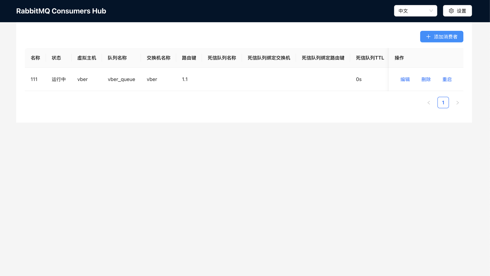

# RabbitMQ 管理工具

## 项目简介

这是一个用于轻松管理和查看RabbitMQ消费者的管理工具。

## 功能特性

- 集中管理多个RabbitMQ队列的消费者
- 提供Web界面用于监控和管理消费者状态
- 支持多语言界面(中文和英文)

## 技术栈

- 后端: Go
- 前端: React
- 消息队列: RabbitMQ
- 数据库: Sqlite3

## 项目结构

- `api/`: API接口定义和实现
- `management_ui/`: Web管理界面
- `MQServer/`: RabbitMQ服务器连接和管理
- `db/`: 数据库操作
- `logs/`: 日志文件
- `main.go`: 主程序入口

## 使用方法
#### 自己创建镜像
1. **环境准备**：
   - 确保已安装 Docker。
   - 确保 Docker 服务正在运行。

2. **构建项目**：
   - 在项目根目录下运行以下命令以构建 Docker 镜像：
     ```bash
     docker build -t rabbitmq-consumer-hub .
     ```
#### 拉取已有镜像
```bash
docker pull vber/rabbitmq-consumer-hub:latest
```

**运行项目**：
   - 使用以下命令启动 Docker 容器：
     ```bash
     docker run -d -p 80:80 rabbitmq-consumer-hub
     ```
**访问应用**：
   - 打开浏览器输入IP加上端口号来访问Web 界面。您可以在设置中配置 RabbitMQ 的连接信息，包括主机、端口、用户和密码。




## 许可证

本项目采用自定义许可证。

版权所有 (c) [2024] [杜伟/vber]

1. 个人使用许可：
   本软件允许个人用户免费使用，但仅限于非商业目的。个人用户可以自由下载、安装、使用和修改本软件，但不得将其用于任何商业用途。

2. 商业使用限制：
   任何商业实体或个人如需将本软件用于商业目的，必须获得版权所有者的书面许可并支付相应的许可费用。

3. 再分发限制：
   未经版权所有者明确书面许可，不得以任何形式或方式重新分发本软件，无论是修改过的还是未修改的版本。

4. 免责声明：
   本软件按"原样"提供，不提供任何明示或暗示的保证，包括但不限于对适销性、特定用途适用性和非侵权性的保证。在任何情况下，作者或版权持有人均不对任何索赔、损害或其他责任负责。

5. 保留权利：
   未明确授予的所有权利均由版权所有者保留。

使用本软件即表示您同意遵守上述许可条款。如果您不同意这些条款，请不要使用本软件。
